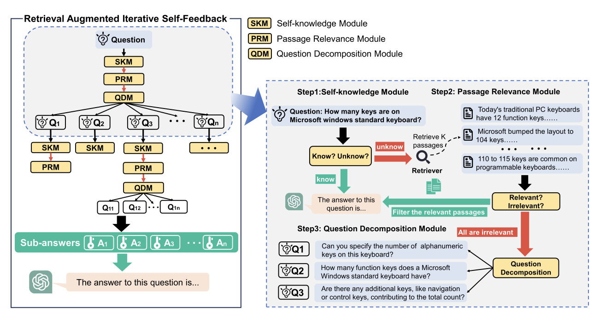

# RA-ISF: Learning to Answer and Understand from Retrieval Augmentation via Iterative Self-Feedback


<p align="center">
</a>


</p>


This is the official repository of the paper: [RA-ISF: Learning to Answer and Understand from Retrieval Augmentation via Iterative Self-Feedback](https://arxiv.org/abs/2403.06840).



🔥 We have released the version 1.0 for llama2_13b base model.

## 🛠️ How to Use

### Step 0

Update your environment for the required dependency. 

```shell
conda create --name raisf python=3.8 -y
conda activate raisf
pip install -r requirement.txt
```

### Step 1 Generate Sub-modules

Our approach involves training three sub-modules, each addressing self-awareness, article relevance, and problem decomposition respectively.

#### Collect datasets for Self-Knowledge

We provide a number of data to ask LLMs, using Openai API to generate final result. For incorrect result, we mark as "unknow".
For correct one, we mark as "know", the data format are formulated as:

```bash
{"question": "{question}", "answer": "know"}
...
{"question": "{question}", "answer": "unknow"}
```


#### Collect datasets for Passage-Relevance

We provide a series of question-passage pairs and prompt the LLM to assess the relevance of the articles. Relevant content is labeled as "relevance," while irrelevant content is labeled as "irrelevance." the data format are formulated as:

```bash
{"question": "{question} + {passage}", "answer": "relevance"}
...
{"question": "{question} + {passage}", "answer": "irrelevance"}
```


#### Collect datasets for Task-Decomposition

We provided a series of questions and asked LLMs to generate sub-questions for the corresponding questions. Meanwhile, some datasets have already provided decompositions of sub-questions, and we have incorporated this correspondence into the training data. the data format are formulated as：

```bash
{"question": "{question}", "answer": "{"query": ["sub_q1", "sub_q2"]}"}
```

#### Training Llama2-7b Sub-modules

For Llama2 model, we adopt [Efficient-Tuning-LLMs](https://github.com/jianzhnie/Efficient-Tuning-LLMs/tree/main) repo for training. For more details, refer to [source/model/llama2](./source/model/llama2)

```shell
cd source/model/llama2
```

We train the submodel utilizing the following scripts.

```bash
CUDA_VISIBLE_DEVICES=0 torchrun --nproc_per_node=1 train.py \
    --model_name_or_path {input_file_path} \
    --data_path {data_path}  \
    --output_dir {output_file_path} \
    --num_train_epochs 3 \
    --per_device_train_batch_size 4 \
    --per_device_eval_batch_size 4 \
    --gradient_accumulation_steps 8 \
    --evaluation_strategy "no" \
    --save_strategy "steps" \
    --save_steps 500 \
    --save_total_limit 5 \
    --learning_rate 2e-5 \
    --weight_decay 0. \
    --warmup_ratio 0.03 \
    --lr_scheduler_type "cosine" \
    --logging_steps 1 \
    --deepspeed "scripts/ds_config/ds_config_zero3_auto.json"
```

#### Training Flan-T5-XL(780M) Sub-modules

When we utilize Flan-T5 as submodels, leveraging the three datasets we've collected, we train using the following script:

```bash
cd source/model/flan-t5
python flan_seq2seq.py  --epochs {epochs} \
    --dropout {dropout}
    --pretrained_ckpt "google/flan-t5-large" \
    --peft_method "sft"
```

Remember to change your dataset_id on [utils.py](./source/model/flan-t5/utils.py)


### Step 2 Setting Retriever

We use [Contriever](https://github.com/facebookresearch/contriever) to retrieve documents.

#### Download data
Download the preprocessed passage data and the generated passaged ([Contriever-MSMARCO](https://huggingface.co/facebook/contriever-msmarco)). 
```
mkdir data/retrieval_wiki
cd data/retrieval_wiki
wget https://dl.fbaipublicfiles.com/dpr/wikipedia_split/psgs_w100.tsv.gz
wget https://dl.fbaipublicfiles.com/contriever/embeddings/contriever-msmarco/wikipedia_embeddings.tar
```

### Step 3 Processing Retrieval Augmented Iterative Self-Feedback

Modify the `datapath` ,`engine`and `model_path` in [config.py](./config.py) and [contriever_config.py](./contriever_config.py) to match your actual paths of the used datasets. Refer to these file for more config details.

```bash
python main.py --engine "llama2-13b"
      --base_model_path {base_model_path} \
      --self_knowledge_model_path {self_knowledge_model_path} \
      --passage_relevance_model_path {passage_relevance_model_path} \
      --task_decomposition_model_path {task_decomposition_model_path} \
      --data_path {data_path} \
      --n_docs {Number of documents to retrieve per questions} \
      --model_name_or_path {contriever_model_path} \
      --passages_embedding "wikipedia_embeddings/*" \
```


## Evaluation results


Results showed that our method achieved SOTA on four out of five datasets, with an average improvement of +1.9 compared to the best-performing method.

## Citation

If you use this codebase, or RA-ISF inspires your work, please cite:

```bibtex 
@misc{liu2024raisf,
      title={RA-ISF: Learning to Answer and Understand from Retrieval Augmentation via Iterative Self-Feedback}, 
      author={Yanming Liu and Xinyue Peng and Xuhong Zhang and Weihao Liu and Jianwei Yin and Jiannan Cao and Tianyu Du},
      year={2024},
      eprint={2403.06840},
      archivePrefix={arXiv},
      primaryClass={cs.CL}
}
